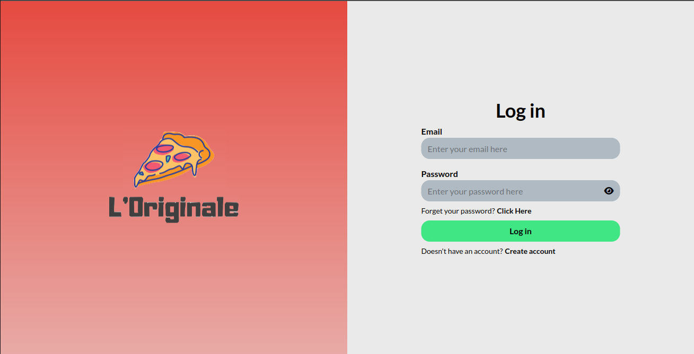
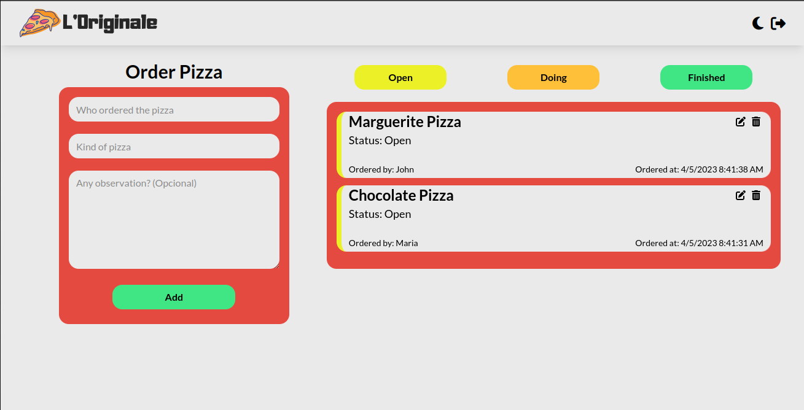

# L'Originale

A React + Firebase Project that allows the employees of a Pizzeria to make pizza orders, delete and/or change the status of the order.





## Features

- Log in/Register account with Firebase Auth and React Firebase Hooks
- Adding orders and storing them in Firebase Firestore and React Firebase Hooks
- Filter the orders by their status.
- Delete orders and/or change their status
- Responsive design
- Dark Mode

## Languages and tools

- Typescript (^4.9.3)
- React (^18.2.0)
- TailwindCSS (^3.2.7)
- Firebase (^9.18.0)
- Vite (^4.2.0)
- React Firebase Hooks (^5.1.1)
- Figma

### Setup

1. Create an account on Firebase and get your Firebase Config.
2. In the root of the project create a `.env` file for storing firebase secrets:

   ```env
   VITE_API_KEY    VITE_FIREBASE_AUTH_DOMAIN =
   VITE_FIREBASE_PROJECT_ID =
   VITE_FIREBASE_STORAGE_BUCKET =
   VITE_FIREBASE_MESSAGING_ID =
   VITE_FIREBASE_APP_ID =
   ```

#### Requirements

- NodeJS
- NPM

```

/* Install the needed packages */
npm install

/* To run the application */
npm run dev

/* Open the local host */
o

```

<p align="center">
<sub>A project by <a href="http://thawan.netlify.app/">Thawan Silva</a></sub>
</p>
